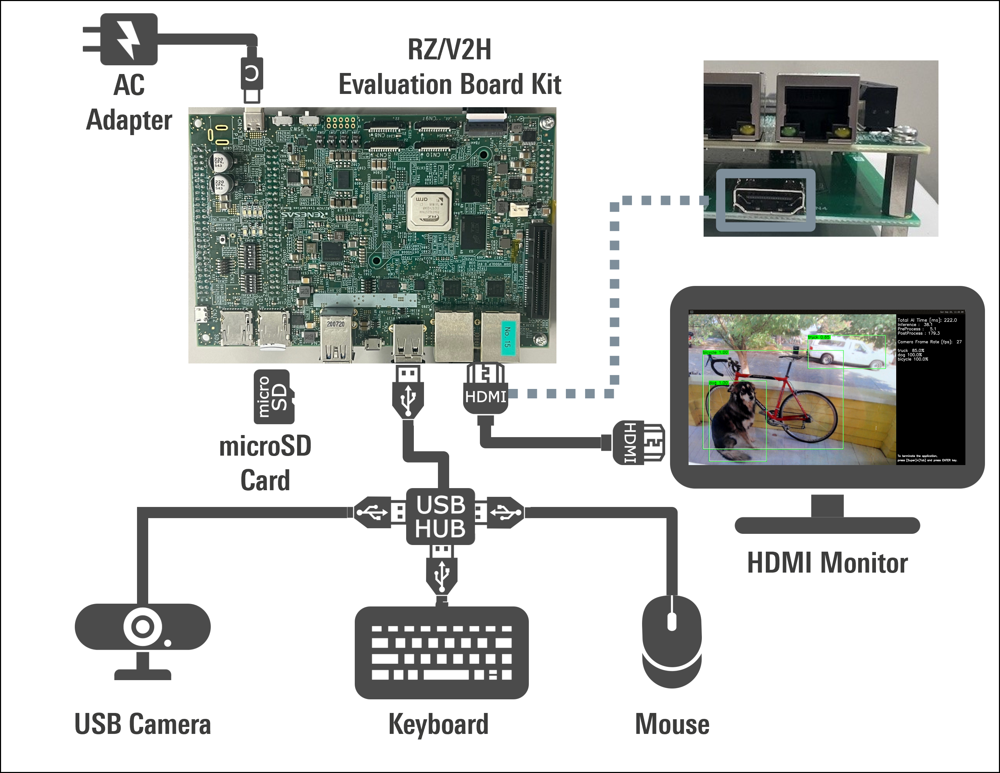
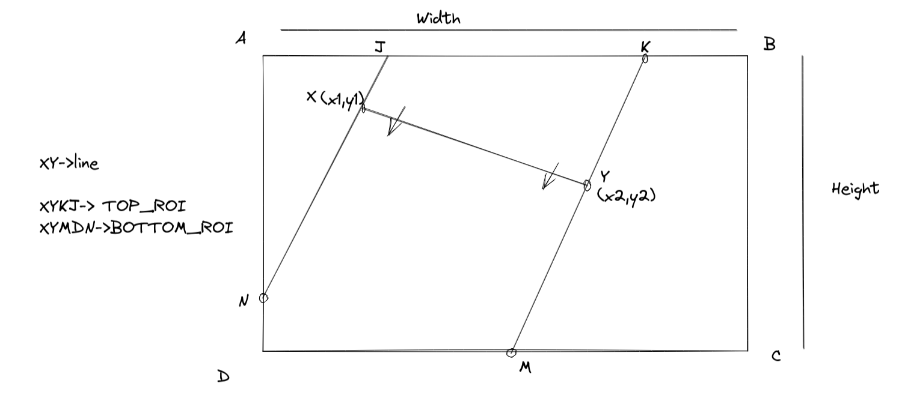
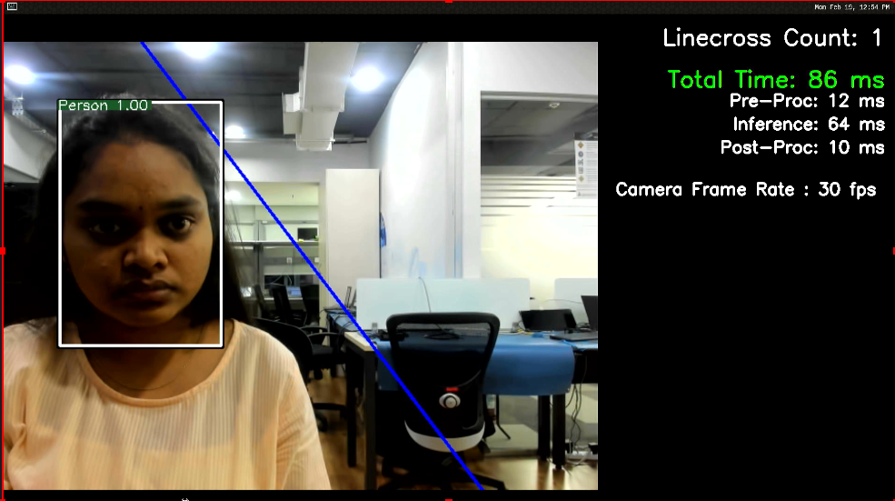

# 02_Line_crossing_object_counting

## Application: Overview
Line crossing object counting is a sample application that demonstrates counting of the objects when they cross a virtual line drawn by the user. Application uses a deep learning based object detector YoloV3 to detect the objects and a SORT based tracker to track the objects.

<!-- The AI model used for the sample application is [YOLOV3](https://arxiv.org/pdf/1910.01271.pdf). -->


### Targeted product

 - RZ/V2H Evaluation Board Kit (RZ/V2H EVK)
### Sample video 
- [Line crossing object counting demo](https://youtu.be/Y_C829DTFE8)  on YouTube

## Application: Requirements

#### Hardware Requirements
Prepare the following equipments referring to [Getting Started](https://renesas-rz.github.io/rzv_ai_sdk/getting_started).
| Equipment | Details |
| ---- | ---- |
| RZ/V2H EVK | Evaluation Board Kit for RZ/V2H |
| USB camera | - |
| HDMI monitor | Display the application. |
| HDMI cable | Connect HDMI monitor and RZ/V2H Board. |
| microSD Card | Used as filesystem. |
| USB Hub | Used for connecting USB Mouse and USB Keyboard to the board. |
| USB Mouse | Used for HDMI screen control. |
| USB Keyboard | Used for terminal input. |
>**Note:**
All external devices will be attached to the board and does not require any driver installation (Plug n Play Type).

Connect the hardware as shown below.  

 


When using the keyboard connected to RZ/V2H Evaluation Board, the keyboard layout and language are fixed to English.

## Application: Build Stage

>**Note:** User can skip to the next stage (deploy) if they don't want to build the application. All pre-built binaries are provided.

This project expects the user to have completed [Getting Started](https://renesas-rz.github.io/rzv_ai_sdk/getting_started) provided by Renesas. 

After completion of Getting Started, the user is expected of following conditions.
- The board setup is done.
- SD card is prepared.
- The docker container of `rzv2h_ai_sdk_image` is running on the host machine.

>**Note:** Docker environment is required for building the application. 


#### Application File Generation
1. On your host machine, download the repository from the GitHub to the desired location. 
    1. It is recommended to download/clone the repository on the `data` folder which is mounted on the `rzv2h_ai_sdk_container` docker container as shown below. 
    ```sh
    cd <path_to_data_folder_on_host>/data
    git clone https://github.com/Ignitarium-Renesas/rzv_ai_apps.git
    ```
    > Note 1: Please verify the git repository url if error occurs.

    > Note 2: This command will download whole repository, which include all other applications.<br>
     If you have already downloaded the repository of the same version, you may not need to run this command.
    
2. Run (or start) the docker container and open the bash terminal on the container.  
Here, we use the `rzv2h_ai_sdk_container` as the name of container, created from  `rzv2h_ai_sdk_image` docker image.  
    > Note that all the build steps/commands listed below are executed on the docker container bash terminal.  

3. Set your clone directory to the environment variable.  
    ```sh
    export PROJECT_PATH=/drp-ai_tvm/data/rzv_ai_apps
    ```
3. Go to the application source code directory.  
    ```sh
    cd ${PROJECT_PATH}/02_Line_crossing_object_counting/src
    ```
4. Build the application by following the commands below.  
    ```sh
    mkdir -p build && cd build
    cmake -DCMAKE_TOOLCHAIN_FILE=./toolchain/runtime.cmake -DV2H=ON ..
    make -j$(nproc)
    ```
5. The following application file would be genarated in the `${PROJECT_PATH}/02_Line_crossing_object_counting/src/build` directory
- line_crossing_app


## Application: Deploy Stage
For the ease of deployment all the deployables file and folders are provided on the [exe_v2h](./exe_v2h) folder.

|File | Details |
|:---|:---|
|line_crossing_yolov3 | Model object files for deployment.|
|line_crossing_app | application file. |

1. Follow the steps below to deploy the project on the board. 
    1. Run the commands below to download the `02_Line_crossing_deploy_tvm-v221.so` from [Release v4.00](https://github.com/Ignitarium-Renesas/rzv_ai_apps/releases/tag/v4.00)
    ```
    cd ${PROJECT_PATH}/02_Line_crossing_object_counting/exe_v2h/line_crossing_yolov3
    wget https://github.com/Ignitarium-Renesas/rzv_ai_apps/releases/download/v4.00/02_Line_crossing_deploy_tvm-v221.so
    ```
    2. Rename the `02_Line_crossing_deploy_tvm-v221.so` to `deploy.so`.
    ```
    mv 02_Line_crossing_deploy_tvm-v221.so deploy.so
    ```
    3. Copy the following files to the `/home/root/tvm` directory of the rootfs (SD Card) for the board.
        -  All files in [exe_v2h](./exe_v2h) directory. (Including `deploy.so` file.)
        -  `02_Line_crossing_object_counting` application file if you generated the file according to [Application File Generation](#application-file-generation)
    4. Check if `libtvm_runtime.so` is there on `/usr/lib64` directory of the rootfs (SD card) on the board.

2. Folder structure in the rootfs (SD Card) would look like:
```sh
├── usr/
│   └── lib64/
│       └── libtvm_runtime.so
└── home/
    └── root/
        └── tvm/ 
            ├── line_crossing_yolov3/
            │   ├── deploy.json
            │   ├── deploy.params
            │   └── deploy.so
            ├── labels.txt
            └── line_crossing_app
```
>**Note:** The directory name could be anything instead of `tvm`. If you copy the whole `exe_v2h` folder on the board. You are not required to rename it `tvm`.

## How line crossing/counting works
- User gives the co-ordinates to draw the line (x1,y1),(x2,y2) and flow of direction(0/1). ( 0 means left to right, 1 means right to left).
- This line creates two virtual region of interest (top_roi,bottom_roi).
- To check if an person has moved from one roi to another, their first occurance(object_id) is stored in a hashmap.
- When a person from one roi moves to the other roi, depending upon the direction the counter is incremented.



## Application: Run Stage

1. On the board terminal, go to the `tvm` directory of the rootfs.
```sh
cd /home/root/tvm/
```
2. Run the application.

   - Application with USB camera input
    ```sh
    ./line_crossing_app USB person 150 0 950 1050 1
    ```
3. Following window shows up on HDMI screen.  
   
        
4. To terminate the application, switch the application window to the terminal by using Super(windows key)+ Tab and press ENTER key on the terminal of the board.

## Application: Configuration 
### AI Model
- YOLOv3: [Darknet](https://pjreddie.com/darknet/yolo/)  
- Dataset: [HollywoodHeads](https://www.di.ens.fr/willow/research/headdetection/)

  Input size: 1x3x416x416 \
  Output1 size: 1x13x13x18 \
  Output2 size: 1x26x26x18 \
  Output3 size: 1x52x52x18
 
### AI inference time
|Board | AI inference time|
|:---|:---|
|RZ/V2H EVK | Approximately  25ms |
 
### Processing
 
|Processing | Details |
|:---|:---|
|Pre-processing | Processed by CPU. <br> |
|Inference | Processed by DRP-AI and CPU. |
|Post-processing | Processed by CPU. |


## Reference
- For RZ/V2H EVK, this application supports USB camera only with 640x480 resolution.  
FHD resolution is supported by e-CAM22_CURZH camera (MIPI).  
Please refer to following URL for how to change camera input to MIPI camera.  
[https://renesas-rz.github.io/rzv_ai_sdk/latest/about-applications](https://renesas-rz.github.io/rzv_ai_sdk/latest/about-applications#mipi). 
