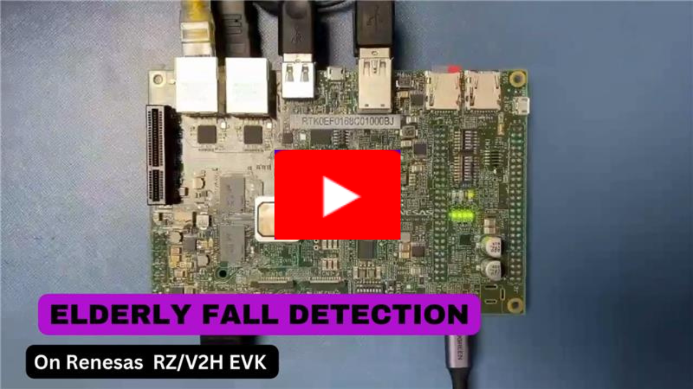
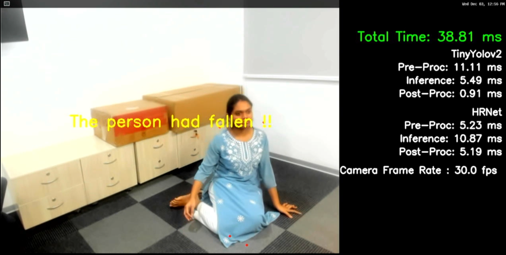

# 03_Elderly_fall_detection

## Application: Overview
Falling while standing is one of the major accident that occurs with elderly people causing severe injuries. Therefore, fall detection systems are becoming increasingly important at old age homes, hospitals and even normal residence. Fall detection systems enabled with vision based Ai examine human movement and perform activity recognition to detect falling events in input videos from camera.

The AI model used for the sample application is [TINYYOLOV2](https://arxiv.org/pdf/1612.08242.pdf) ,[HRNet](https://arxiv.org/abs/1902.09212).

### Targeted product
| Product | Supported AI SDK version |
| ---- | ---- |
| RZ/V2H Evaluation Board Kit (RZ/V2H EVK) | RZ/V2H AI SDK **v5.20** |
| RZ/V2N Evaluation Board Kit (RZ/V2N EVK) | RZ/V2N AI SDK **v6.00** |

### Sample Video for RZ/V2H on Youtube
<a href="https://youtu.be/-euUDJJyUf0" target="_blank\">
  
</a>

## Application: Requirements

#### Hardware Requirements
Prepare the following equipments referring to [Getting Started](https://renesas-rz.github.io/rzv_ai_sdk/getting_started).
| Equipment | Details |
| ---- | ---- |
| RZ/V2H, RZ/V2N EVK | Evaluation Board Kit for RZ/V2H, RZ/V2N |
| USB camera | Used as a camera input source. |
| HDMI monitor | Used to display the graphics of the board. |
| USB Cable Type-C | Connect AC adapter and the board. |
| HDMI cable | Connect HDMI monitor and RZ/V2H, RZ/V2N Board. |
| AC Adapter | USB Power Delivery adapter for the board power supply.<br>100W is required. |
| microSD Card | Must have over 16GB capacity of blank space.<br>Operating Environment: Transcend UHS-I microSD 300S 16GB |
| Linux PC | Used to build application and setup microSD card.<br>Operating Environment: Ubuntu 20.04 |
| SD card reader | Used for setting up microSD card. |
| USB Hub | Used for connecting USB Mouse and USB Keyboard to the board. |
| USB Mouse | Used for HDMI screen control. |
| USB Keyboard | Used for terminal input. |
>**Note:**
All external devices will be attached to the board and does not require any driver installation (Plug n Play Type).

Connect the hardware as shown below.  

|RZ/V2H EVK | RZ/V2N EVK |
|:---|:---|
|| |

When using the keyboard connected to RZ/V Evaluation Board, the keyboard layout and language are fixed to English.

## Application: Build Stage

>**Note:** User can skip to the next stage (deploy) if they don't want to build the application. All pre-built binaries are provided.

This project expects the user to have completed [Getting Started](https://renesas-rz.github.io/rzv_ai_sdk/getting_started) provided by Renesas. 

After completion of Getting Started, the user is expected of following conditions.
- The board setup is done.
- SD card is prepared.
- Following docker container is running on the host machine.

   | Board| Docker container |
   | ---- | ---- |
   | RZ/V2H EVK | rzv2h_ai_sdk_container |
   | RZ/V2N EVK | rzv2n_ai_sdk_container |

    >**Note 1:** Docker environment is required for building the application.  
<!--    >**Note 2:** Since RZ/V2N is a brother chip of RZ/V2H, the same environment can be used.  -->

#### Application File Generation
1. On your host machine, download the repository from the GitHub to the desired location. 
    1. It is recommended to download/clone the repository on the `data` folder which is mounted on the docker container as shown below. 
    ```sh
    cd <path_to_data_folder_on_host>/data
    git clone https://github.com/Ignitarium-Renesas/rzv_ai_apps.git
    ```
    > Note 1: Please verify the git repository url if error occurs.

    > Note 2: This command will download whole repository, which include all other applications.<br>
     If you have already downloaded the repository of the same version, you may not need to run this command.
    
2. Run (or start) the docker container and open the bash terminal on the container.  
E.g., for RZ/V2H, use the `rzv2h_ai_sdk_container` as the name of container, created from  `rzv2h_ai_sdk_image` docker image.  
    > Note that all the build steps/commands listed below are executed on the docker container bash terminal.  

3. Set your clone directory to the environment variable.  
    ```sh
    export PROJECT_PATH=/drp-ai_tvm/data/rzv_ai_apps
    ```
4. Go to the application source code directory.  
    ```sh
    cd ${PROJECT_PATH}/03_Elderly_fall_detection/src
    ```
5. Build the application by following the commands below.  
    ```sh
    mkdir -p build && cd build
    cmake -DCMAKE_TOOLCHAIN_FILE=./toolchain/runtime.cmake ..
    make -j$(nproc)
    ```
6. The following application file would be genarated in the `${PROJECT_PATH}/03_Elderly_fall_detection/src/build` directory
   - elderly_fall_detection_app
     
<!--    >**Note:** Since RZ/V2N is a brother chip of RZ/V2H,  the same source code can be used.  -->


## Application: Deploy Stage
For the ease of deployment all the deployables file and folders are provided in following folder.
|Board | `EXE_DIR` |
|:---|:---|
|RZ/V2H EVK|[exe_v2h](./exe_v2h)  |
|RZ/V2N EVK|[exe_v2n](./exe_v2n)  |
<!-- >**Note:** Since RZ/V2N is a brother chip of RZ/V2H,  the same execution environment can be used.  -->

Each folder contains following items.
|File | Details |
|:---|:---|
|elderly_fall_detection_tinyyolov2| Model object files for deployment.|
|elderly_fall_detection_hrnet| Model object files for deployment.|
|elderly_fall_detection_app | application file. |

1. Follow the steps below to deploy the project on the board. 
    1. For RZ/V2H
       1. Verify the presence of `deploy.so` file in `${PROJECT_PATH}/03_Elderly_fall_detection/exe_v2h/elderly_fall_detection_hrnet` &  `${PROJECT_PATH}/03_Elderly_fall_detection/exe_v2h/elderly_fall_detection_tinyyolov2`
    2. For RZ/V2N
       1. Verify the presence of `deploy.so` file in `${PROJECT_PATH}/03_Elderly_fall_detection/exe_v2n/elderly_fall_detection_hrnet` &  `${PROJECT_PATH}/03_Elderly_fall_detection/exe_v2n/elderly_fall_detection_tinyyolov2`
    3. Copy the following files to the `/home/*/tvm` directory of the rootfs (SD Card) for the board:
       - All files in `<EXE_DIR>` directory (including `deploy.so` file)
       - `03_Elderly_fall_detection` application file if you generated the file according to [Application File Generation](#application-file-generation)

2. Folder structure in the rootfs (SD Card) is shown below.<br>
   Check if `libtvm_runtime.so` exists in the rootfs directory (SD card) on the board.
- For RZ/V2H
```sh
├── usr/
│   └── lib64/
│       └── libtvm_runtime.so
└── home/
    └── root/
        └── tvm/ 
            ├── elderly_fall_detection_tinyyolov2/
            │   ├── deploy.json
            │   ├── deploy.params
            │   └── deploy.so
            ├── elderly_fall_detection_hrnet/
            │   ├── deploy.json
            │   ├── deploy.params
            │   └── deploy.so
            ├── labels.txt
            └── elderly_fall_detection_app
```
   - For RZ/V2N
```sh
├── usr/
│   └── lib/
│       └── libtvm_runtime.so
└── home/
　　└── weston/
　　　　└── tvm/
            ├── elderly_fall_detection_tinyyolov2/
            │   ├── deploy.json
            │   ├── deploy.params
            │   └── deploy.so
            ├── elderly_fall_detection_hrnet/
            │   ├── deploy.json
            │   ├── deploy.params
            │   └── deploy.so
            ├── labels.txt
            └── elderly_fall_detection_app
```

>**Note:** The directory name could be anything instead of `tvm`. If you copy the whole `exe_v2h` folder on the board. You are not required to rename it `tvm`.

## Application: Run Stage

1. On the board terminal, go to the `tvm` directory of the rootfs.
   - For RZ/V2H
    ```sh
    cd /home/root/tvm
    ```
   - For RZ/V2N
    ```sh
    cd /home/weston/tvm
    ```
2. Run the application with USB camera input.
   - For RZ/V2H
    ```sh
    ./elderly_fall_detection_app USB
    ```
   - For RZ/V2N
    ```sh
    su
    ./elderly_fall_detection_app USB
    exit    # After pressing ENTER key to terminate the application.
    ```
>**Note:** For RZ/V2N AI SDK v6.00 and later, you need to switch to the root user with the 'su' command when running an application.<br>
This is because when you run an application from a weston-terminal, you are switched to the "weston" user, which does not have permission to run the /dev/xxx device used in the application.<br>

3. Following window shows up on HDMI screen*.  
  
*Performance in the screenshot is for RZ/V2H EVK.

4. To terminate the application, switch the application window to the terminal by using Super(windows key)+ Tab and press ENTER key on the terminal of the board.

## Application: Configuration 

## AI Model
- TinyYOLOV2: [Darknet](https://pjreddie.com/darknet/yolo/)  
- Dataset: *[E-FPDS or FPDS_v2 Dataset](https://gram.web.uah.es/data/datasets/fpds/index.html#:~:text=E%2DFPDS%20dataset%20is%20divided,except%20the%20provided%20test%20images.​)
  
Input size: 1x3x416x416  
Output size: 1x13x13x30  
 
- HRNet: [HRNet](https://github.com/PINTO0309/PINTO_model_zoo/tree/main/271_HRNet) 
- Dataset: *[MPII Human Pose Dataset]( https://www.mpi-inf.mpg.de/departments/computer-vision-and-machine-learning/software-and-datasets/mpii-human-pose-dataset/download)
  
Input size: 1x3x256x256  
Output size: 1x16x16x64  
 
### AI inference time
|Board | AI inference time|
|:---|:---|
|RZ/V2H EVK | Approximately <br> Tinyyolov2: 5.7ms <br> HRNet: 17.4ms|
|RZ/V2N EVK | Approximately <br> Tinyyolov2: 12ms <br> HRNet: 34ms|

### Processing
 
|Processing | Details |
|:---|:---|
|Pre-processing | Processed by CPU. <br> |
|Inference | Processed by DRP-AI and CPU. |
|Post-processing | Processed by CPU. |

## Limitation

- Full body of the person should be visible in the camera.This is the limitation from both tinyyolov2 detector and HR-Net keypoints detector. 


## Reference
- For RZ/V2H, RZ/V2N EVK, this application supports USB camera only with 640x480 resolution.  
FHD resolution is supported by e-CAM22_CURZH camera (MIPI).  
Please refer to following URL for how to change camera input to MIPI camera.  

[https://renesas-rz.github.io/rzv_ai_sdk/latest/about-applications](https://renesas-rz.github.io/rzv_ai_sdk/latest/about-applications#mipi). 
