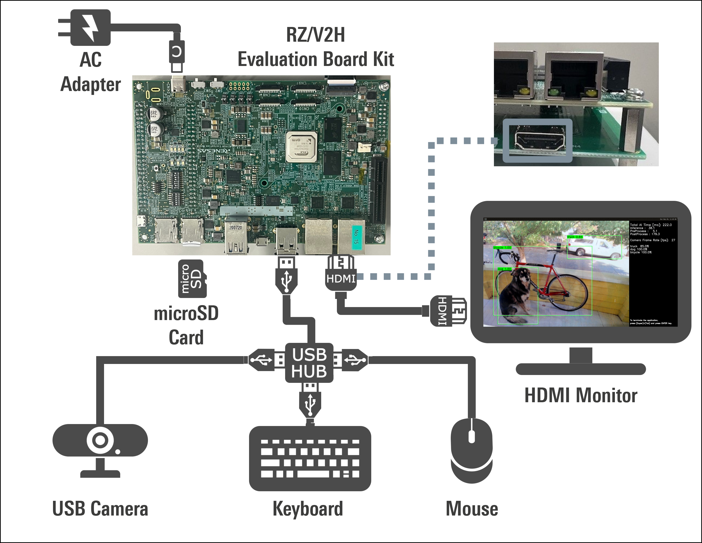

# 09_Human_gaze_detection

## Application: Overview
Gaze Detection is a task to predict where a person is looking at. Human gaze is important information for applications such as Driver Monitor Systems to monitor driver's attentiveness. It can also help to analyse viewer's attention data in case of digital signage and retail industry.

The AI model used for the sample application is [TINYYOLOV2](https://arxiv.org/pdf/1910.01271.pdf) ,[ResNet18](https://arxiv.org/pdf/1512.03385.pdf).

### Targeted product

 - RZ/V2H EVK

## Application: Requirements

#### Hardware Requirements
Prepare the following equipments referring to [Getting Started](https://renesas-rz.github.io/rzv_ai_sdk/getting_started).
| Equipment	Details | Details |
| ---- | ---- |
| RZ/V2H EVK Evaluation Board Kit | - |
| USB camera | - |
| HDMI monitor | Display the application. |
| micro HDMI to HDMI cable | Connect HDMI monitor and RZ/V2H Board. |
| SD Card | Used as filesystem. |
| USB Hub | Used for connecting USB Mouse and USB Keyboard to the board. |
| USB Mouse | Used for HDMI screen control. |
| USB Keyboard | Used for terminal input. |
>**Note:**
All external devices will be attached to the board and does not require any driver installation (Plug n Play Type).

When using the keyboard connected to RZ/V2H EVK Evaluation Board, the keyboard layout and language are fixed to English.

## Application: Build Stage

>**Note:** User can skip to the next stage (deploy) if they don't want to build the application. All pre-built binaries are provided.

This project expects the user to have completed [Getting Started](https://renesas-rz.github.io/rzv_ai_sdk/getting_started) provided by Renesas. 

After completion of Getting Started, the user is expected of following conditions.
- The board setup is done.
- SD card is prepared.
- The docker container of `rzv2h_ai_sdk_image` is running on the host machine.

>**Note:** Docker environment is required for building the application. 


#### Application File Generation
1. On your host machine, download the repository from the GitHub to the desired location. 
    1. It is recommended to download/clone the repository on the `data` folder which is mounted on the `rzv2h_ai_sdk_container` docker container as shown below. 
    ```sh
    cd <path_to_data_folder_on_host>/data
    git clone https://github.com/Ignitarium-Renesas/rzv_ai_apps.git
    ```
    > Note 1: Please verify the git repository url if error occurs.

    > Note 2: This command will download whole repository, which include all other applications.<br>
     If you have already downloaded the repository of the same version, you may not need to run this command.
    
2. Run (or start) the docker container and open the bash terminal on the container.  
Here, we use the `rzv2h_ai_sdk_container` as the name of container, created from  `rzv2h_ai_sdk_image` docker image.  
    > Note that all the build steps/commands listed below are executed on the docker container bash terminal.  

3. Set your clone directory to the environment variable.  
    ```sh
    export PROJECT_PATH=/drp-ai_tvm/data/rzv_ai_apps
    ```
3. Go to the application source code directory.  
    ```sh
    cd ${PROJECT_PATH}/09_Human_gaze_detection/src
    ```
4. Build the application by following the commands below.  
    ```sh
    mkdir -p build && cd build
    cmake -DCMAKE_TOOLCHAIN_FILE=./toolchain/runtime.cmake -DV2H=ON ..
    make -j$(nproc)
    ```
5. The following application file would be genarated in the `${PROJECT_PATH}/09_Human_gaze_detection/src/build` directory
- human_gaze_detection_app

## Hardware Image 


## Application: Deploy Stage
For the ease of deployment all the deployables file and folders are provided on the [exe](./exe) folder.

|File | Details |
|:---|:---|
|human_gaze_tinyyolov2| Model object files for deployment.<br>Pre-processing Runtime Object files included. |
|human_gaze_detection_app | application file. |

1. Follow the steps below to deploy the project on the board. 

    1. Verify the presence of `deploy.so` file in {PROJECT_PATH}/09_Human_gaze_detection/exe/tinyyolov2_onnx &{PROJECT_PATH}/09_Human_gaze_detection/exe/resnet18_onnx
    2. Copy the following files to the `/home/root/tvm` directory of the rootfs (SD Card) for the board.
        -  All files in [exe](./exe) directory. (Including `deploy.so` file.)
        -  `09_Human_gaze_detection` application file if you generated the file according to [Application File Generation](#application-file-generation)
    3. Check if `libtvm_runtime.so` is there on `/usr/lib64` directory of the rootfs (SD card) on the board.

2. Folder structure in the rootfs (SD Card) would look like:
```sh
├── usr/
│   └── lib64/
│       └── libtvm_runtime.so
└── home/
    └── root/
        └── tvm/ 
            ├── human_gaze_tinyyolov2/
            │   ├── deploy.json
            │   ├── deploy.params
            │   └── deploy.so
            ├── human_gaze_resnet18/
            │   ├── deploy.json
            │   ├── deploy.params
            │   └── deploy.so
            ├── labels.txt
            └── human_gaze_detection_app
```
>**Note:** The directory name could be anything instead of `tvm`. If you copy the whole `exe` folder on the board. You are not required to rename it `tvm`.


## Application: Run Stage

1. On the board terminal, go to the `tvm` directory of the rootfs.
```sh
cd /home/root/tvm/09_Human_gaze_detection/exe
```
2. Run the application.

   - Application with USB camera input
    ```sh
    ./human_gaze_detection_app USB 2 5 
    ```
3. Following window shows up on HDMI screen.  
   sample images 
        
4. To terminate the application, switch the application window to the terminal by using Super(windows key)+ Tab and press ENTER key on the terminal of the board.

## Application: Configuration 

## Model details
### ResNet-18

- Model: [ResNet-18](https://arxiv.org/pdf/1512.03385.pdf)
- Repository: [pytorch_mpiigaze](https://github.com/hysts/pytorch_mpiigaze)
- Dataset: [ETH-XGaze](https://www.mpi-inf.mpg.de/departments/computer-vision-and-machine-learning/research/gaze-based-human-computer-interaction/appearance-based-gaze-estimation-in-the-wild)

### TinyYOLOv2

- Model: [TinyYOLOV2](https://pjreddie.com/darknet/yolo/)  
- Dataset: [HollywoodHeads](https://www.di.ens.fr/willow/research/headdetection/)

### AI total time
The AI total time is around 100 msec, which includes 
pre processig, post processing and inference time.


