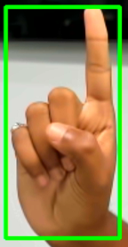
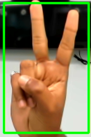
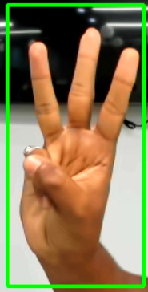
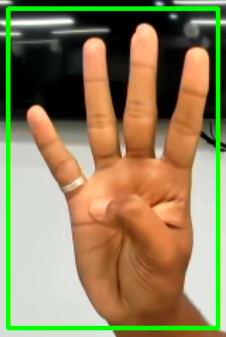
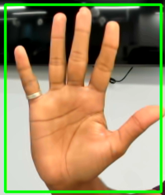
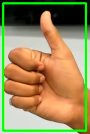
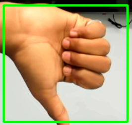
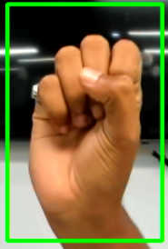
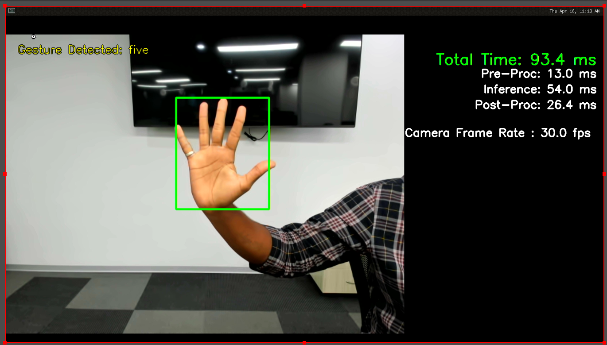

# 12_Hand_gesture_recognition_v2

This application is not covered with MIT license. This application is licensed with Attribution-ShareAlike 4.0 International (CC BY-SA 4.0) license.
Please have a look at dos and dont's here : [Creative commons website link](https://creativecommons.org/licenses/by-sa/4.0/deed.en)
Hand gesture model's reference : [Dataset link](https://github.com/hukenovs/hagrid)

User can :
Share — copy and redistribute the material in any medium or format
Adapt — remix, transform, and build upon the material for any purpose, even commercially.

Under these terms:
Attribution — You must give appropriate credit, provide a link to the license, and indicate if changes were made. You may do so in any reasonable manner, but not in any way that suggests the licensor endorses you or your use.
ShareAlike — If you remix, transform, or build upon the material, you must distribute your contributions under the same license as the original.
No additional restrictions — You may not apply legal terms or technological measures that legally restrict others from doing anything the license permits.

## Application: Overview
This application showcases the capability of deep neural networks to predict different hand gestures. It detect total of 8 Gestures that includes one, two, three, four, five, thumbs up, thumbs down and rock in the hand with the highest precision.

The AI model used for the sample application is [YOLOV3](https://arxiv.org/pdf/1804.02767.pdf).

## Features
This application 12_Hand_gesture_recognition_v2 detects the following

<table style="width:100%; border-collapse: collapse;">
    <tr>
        <td style="text-align: center; padding: 10px;">
            <p>one</p>
            
        </td>
        <td style="text-align: center; padding: 10px;">
            <p>two</p>
            
        </td>
        <td style="text-align: center; padding: 10px;">
            <p>three</p>
            
        </td>
        <td style="text-align: center; padding: 10px;">
            <p>four</p>
            
        </td>
    </tr>
    <tr>
        <td style="text-align: center; padding: 10px;">
            <p>five</p>
            
        </td>
        <td style="text-align: center; padding: 10px;">
            <p>thumbs_up</p>
            
        </td>
        <td style="text-align: center; padding: 10px;">
            <p>thumbs_down</p>
            
        </td>
        <td style="text-align: center; padding: 10px;">
            <p>rock</p>
            
        </td>
    </tr>
</table>

### Targeted product

 - RZ/V2H Evaluation Board Kit (RZ/V2H EVK)
### Sample video 
- [Hand gesture recognition demo](https://youtu.be/bmhasiAWMbQ)  on YouTube

## Application: Requirements

#### Hardware Requirements
Prepare the following equipments referring to [Getting Started](https://renesas-rz.github.io/rzv_ai_sdk/getting_started).
| Equipment | Details |
| ---- | ---- |
| RZ/V2H EVK | Evaluation Board Kit for RZ/V2H |
| USB camera | - |
| HDMI monitor | Display the application. |
| HDMI cable | Connect HDMI monitor and RZ/V2H Board. |
| microSD Card | Used as filesystem. |
| USB Hub | Used for connecting USB Mouse and USB Keyboard to the board. |
| USB Mouse | Used for HDMI screen control. |
| USB Keyboard | Used for terminal input. |
>**Note:**
All external devices will be attached to the board and does not require any driver installation (Plug n Play Type).

Connect the hardware as shown below.  


When using the keyboard connected to RZ/V2H EVK Evaluation Board, the keyboard layout and language are fixed to English.

## Application: Build Stage

>**Note:** User can skip to the next stage (deploy) if they don't want to build the application. All pre-built binaries are provided.

This project expects the user to have completed [Getting Started](https://renesas-rz.github.io/rzv_ai_sdk/getting_started) provided by Renesas. 

After completion of Getting Started, the user is expected of following conditions.
- The board setup is done.
- SD card is prepared.
- The docker container of `rzv2h_ai_sdk_image` is running on the host machine.

>**Note:** Docker environment is required for building the application. 


#### Application File Generation
1. On your host machine, download the repository from the GitHub to the desired location. 
    1. It is recommended to download/clone the repository on the `data` folder which is mounted on the `rzv2h_ai_sdk_container` docker container as shown below. 
    ```sh
    cd <path_to_data_folder_on_host>/data
    git clone https://github.com/Ignitarium-Renesas/rzv_ai_apps.git
    ```
    > Note 1: Please verify the git repository url if error occurs.

    > Note 2: This command will download whole repository, which include all other applications.<br>
     If you have already downloaded the repository of the same version, you may not need to run this command.
    
2. Run (or start) the docker container and open the bash terminal on the container.  
Here, we use the `rzv2h_ai_sdk_container` as the name of container, created from  `rzv2h_ai_sdk_image` docker image.  
    > Note that all the build steps/commands listed below are executed on the docker container bash terminal.  

3. Set your clone directory to the environment variable.  
    ```sh
    export PROJECT_PATH=/drp-ai_tvm/data/rzv_ai_apps
    ```
4. Go to the application source code directory.  
    ```sh
    cd ${PROJECT_PATH}/12_Hand_gesture_recognition_v2/src
    ```
5. Build the application by following the commands below.  
    ```sh
    mkdir -p build && cd build
    cmake -DCMAKE_TOOLCHAIN_FILE=./toolchain/runtime.cmake -DV2H=ON ..
    make -j$(nproc)
    ```
6. The following application file would be genarated in the `${PROJECT_PATH}/12_Hand_gesture_recognition_v2/src/build` directory
- hand_gesture_recognition_v2_app


## Application: Deploy Stage
For the ease of deployment all the deployables file and folders are provided on the [exe_v2h](./exe_v2h) folder.

|File | Details |
|:---|:---|
|hand_yolov3_onnx| Model object files for deployment.|
|hand_gesture_recognition_v2_app | application file. |

1. Follow the steps below to deploy the project on the board. 
    1. Run the commands below to download the `12_Hand_gesture_recognition_v2_deploy_tvm-v221.so` from [Release v4.00](https://github.com/Ignitarium-Renesas/rzv_ai_apps/releases/tag/v4.00)
    ```
    cd ${PROJECT_PATH}/12_Hand_gesture_recognition_v2/exe_v2h/hand_yolov3_onnx
    wget https://github.com/Ignitarium-Renesas/rzv_ai_apps/releases/download/v4.00/12_Hand_gesture_recognition_v2_deploy_tvm-v221.so
    ```
    2. Rename the `12_Hand_gesture_recognition_v2_deploy_tvm-v221.so` to `deploy.so`.
    ```
    mv 12_Hand_gesture_recognition_v2_deploy_tvm-v221.so deploy.so
    ```

    3. Verify the presence of `deploy.so` file in ${PROJECT_PATH}/12_Hand_gesture_recognition_v2/exe_v2h/hand_yolov3_onnx 
    4. Copy the following files to the `/home/root/tvm` directory of the rootfs (SD Card) for the board.
        -  All files in [exe_v2h](./exe_v2h) directory. (Including `deploy.so` file.)
        -  `12_Hand_gesture_recognition_v2` application file if you generated the file according to [Application File Generation](#application-file-generation)
    5. Check if `libtvm_runtime.so` is there on `/usr/lib64` directory of the rootfs (SD card) on the board.

2. Folder structure in the rootfs (SD Card) would look like:
```sh
├── usr/
│   └── lib64/
│       └── libtvm_runtime.so
└── home/
    └── root/
        └── tvm/ 
            ├── hand_yolov3_onnx/
            │   ├── deploy.json
            │   ├── deploy.params
            │   └── deploy.so
            ├── labels.txt
            └── hand_gesture_recognition_v2_app
```
>**Note:** The directory name could be anything instead of `tvm`. If you copy the whole `exe_v2h` folder on the board. You are not required to rename it `tvm`.


## Application: Run Stage

1. On the board terminal, go to the `tvm` directory of the rootfs.
```sh
cd /home/root/tvm
```
2. Run the application.

   - Application with USB camera input
    ```sh
    ./hand_gesture_recognition_v2_app USB 
    ```
3. Following window shows up on HDMI screen.  


   
        
4. To terminate the application, switch the application window to the terminal by using Super(windows key)+ Tab and press ENTER key on the terminal of the board.

## Application: Configuration 

## AI Model
- YoloV3: [Darknet](https://pjreddie.com/darknet/yolo/)  
- Dataset: [HaGRID (HAnd Gesture Recognition Image Dataset)](https://n-ws-620xz-pd11.s3pd11.sbercloud.ru/b-ws-620xz-pd11-jux/hagrid/hagrid_dataset_new_554800/hagrid_dataset_512.zip)
  
Input size: 1x3x416x416  
Output1 size: 1x13x13x39<br>
Output2 size: 1x26x26x39<br>
Output3 size: 1x52x52x39

### AI inference time
|Board | AI inference time|
|:---|:---|
|RZ/V2H EVK | Approximately <br> Yolov3: 26ms|
 
### Processing
 
|Processing | Details |
|:---|:---|
|Pre-processing | Processed by CPU. <br> |
|Inference | Processed by DRP-AI and CPU. |
|Post-processing | Processed by CPU. |

## Limitation
1. The prediction works best when the distance between camera and hand is in between 0.5 - 1.0 meter.
2. The accuracy improves with minimum background noise or movement. 

## Reference
- For RZ/V2H EVK, this application supports USB camera only with 640x480 resolution.  
FHD resolution is supported by e-CAM22_CURZH camera (MIPI).  
Please refer to following URL for how to change camera input to MIPI camera.  

[https://renesas-rz.github.io/rzv_ai_sdk/latest/about-applications](https://renesas-rz.github.io/rzv_ai_sdk/latest/about-applications#mipi). 
